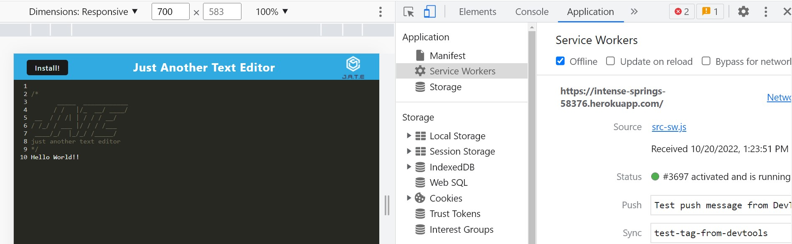
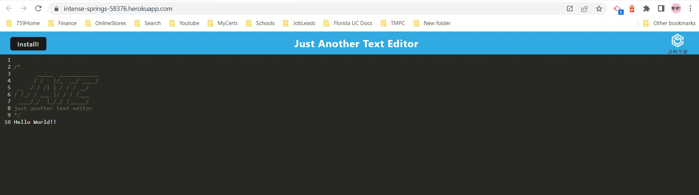
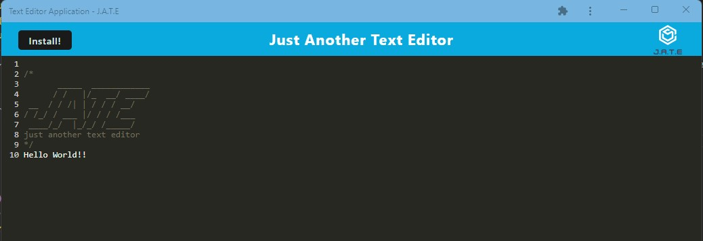

# Just Another Text Editor

 # Badges: 
  

  # GitHub username: moniquemeas
    
  # Table of Contents
  * [Description](#description)
  * [Usage](#usage)
  * [Installation](#installation)
  * [Technology](#technoloy)
  * [Contributing](#contributing)
  * [License](#license)
  * [Contact](#contact)

  # Description:
  This is a single page application that allows users to create notes or code snippets with or without internet connection.

  # Usage
  - The application can be used offline. User is able to use the app in the browser or use the app as a standalone app by installing the application to a device.

  

  

  

  # Installation
  - Clone the repository from Github.
  - Install Node.js
  - npm install below packages:
        * express
        * --save-dev webpack (Webpack)
        * webpack-dev-server --save-dev (webpack-dev-server)
        * --save-dev webpack-pwa-manifest (WebpackPwaManifest)
        * babel (Babel)
        * --save-dev css-loader (CSS-loader)
        * concurrently --save (run multiple commands concurrently.) (Concurrently)
        * idb (IndexedDB)

  # Technology:

  * JavaScript
  * Node.js
  * Webpack
  * Workbox 

  # Deployment Link:

    https://intense-springs-58376.herokuapp.com/
  
 
  
  # Contributing:
  Monique Meas
    
  # License:
  * MIT
  * To find out more about MIT go to:
  * https://opensource.org/licenses/MIT
    
  # Contact:
  monique.meas@gmail.com